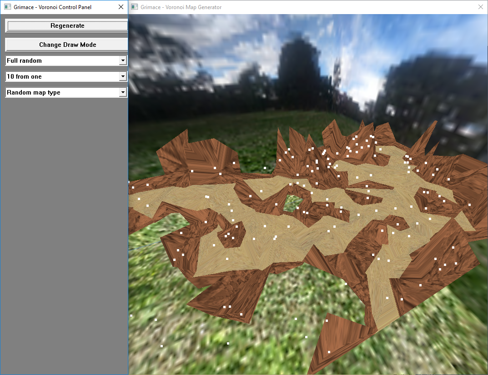

# Voronoi Map Generator
Generator of a 3D scenery model in the style of a level in a role-playing video game, coded in C++. The program was built with the intention of the code being incorporated into a video game, which has since happened, though that project is in progress and is not available on GitHub.

## About
The 3D scenery model is built around a Voronoi diagram. That diagram is generated using Fortune's algorithm, which is a sweep-line algorithm that was originally published in a paper in 1986, though the included implementation was coded by myself in C++.
The generated model is displayed as a rotating 3-dimensional object, using texturing to simulate a real-world atmosphere. Various options are given to control how the map is generated.

## Installation Instructions
You will require Visual Studio installed on your computer, including the component for desktop Windows C++ development.
* Clone this repository
* Download 'glext.h' from [The Khronos Group Inc](https://www.khronos.org/registry/OpenGL/api/GL/glext.h) and place it in the 'Project1' source code directory
* Open the Visual Studio Solution file in the root directory
* Build the solution to create the .exe file
